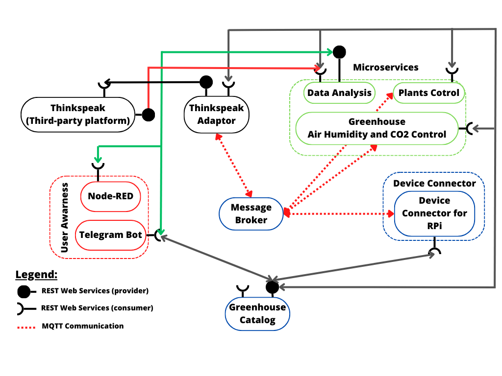

# Programming for IoT applications project - SmartGreenhouse

Project for the course Programming for IoT Applications at Politecnico di Torino, academic year 2022-2023.

SmartGreenhouse is an application used to control and monitor greenhouses. Based on the microservices approach the user could obtain real-time information for the owned greenhouses and plants. All the system is automatically managed through device connectors which have connected sensors and actuators for the correct functioning of the smart greenhouse.

A promo video and a demo version are available on Youtube: 
- *working on*

## Application structure

The communication between actors occurs through two communication paradigms:
- publish/subscribe based on MQTT protocol.
- request/response based on REST Web Services.

The actors involved in the IoT platform are the following:

- The Message broker is a software module that provides an asynchronous communication 
among applications. It exploits the MQTT protocol based on the publish/subscriber approach.

- The Greenhouse Catalog works as a registry system both for devices and services. It 
operates as an entry point for all the actors in the system. For the proposed IoT platform the 
Greenhouse Catalog contains: configuration of humidity and temperature thresholds used by 
the Greenhouse Control and humidity levels needed for each variety of plants used by the 
Plants Control. It also provides a registry of the IoT devices and holds information about the 
variety of the plants assigned to each batch of pots. It is implemented as JSON-based RESTful 
API.

- The Raspberry Pi Connector is a Device Connector that introduces the Raspberry Pi boards 
into the system. The Greenhouse is equipped with temperature, humidity and CO2 sensors in 
order to monitor the Greenhouse's climate conditions and with humidity sensors for each batch 
of plants. They are all controlled by the Raspberry Pi which also manages the actuators 
controlled by the microservices. It exploits the REST Web Services in order to provide to the 
users the information they need, when asked, and it also works as an MQTT publisher to send 
sensor data and as a MQTT subscriber to collect actuation commands from the Control 
Strategy.

- Thingspeak is a third-party software (https://thingspeak.com/) that provides REST Web Services. It 
is an IoT analytics platform service that allows the user to aggregate, visualize and analyse data in the 
cloud.

- The Thingspeak adaptor behaves as an MQTT subscriber that links the selected outputs to the cloud 
platform using REST Web Services.

- The Greenhouse Air Control is a control strategy in charge of the air quality inside the 
Greenhouse, managing temperature and CO2. Based on the comparison between the 
measurements received from the Device Connector and the thresholds stored in the 
Greenhouse Catalog, it turns on the actuation fans system. In the first case, when receiving 
data, it works as an MQTT subscriber and in the second case, when sending actuation 
commands, it works as an MQTT publisher. It is also a REST Client getting information from 
the Greenhouse Catalog.

- The Greenhouse Humidity Control is a control strategy that manages the humidity inside 
the Greenhouse. Based on the comparison between the measurements received from the 
Device Connector and the thresholds stored in the Greenhouse Catalog, it turns on the 
actuation vaporizers system. In the first case, when receiving data, it works as an MQTT 
subscriber and in the second case, when sending actuation commands, it works as an MQTT 
publisher. It is also a REST Client getting information from the Greenhouse Catalog.

- The Plants Control is a control strategy that manages irrigation of each batch of pots of the 
Greenhouse independently. It receives the data from the Device Connector about the humidity 
of a batch of pots. Then the Plants Control decides whether to irrigate the specific batch of 
pots by comparing the current wetness of its soil with the threshold related to the water needed 
by each plant variety. It works as an MQTT subscriber to read the data and as an MQTT 
publisher to send actuation commands. It communicates with the Greenhouse Catalog to get 
the information about the thresholds of the plant varieties by using the REST Web Services.
- Data Analysis is a long term analysis that summarizes the data related to the plants growth 
in the last weeks/months. Moreover it reports a statistic of the future growth of the plants and 
the mean harvest time for each plant variety.
 
- Node-RED is a programming tool developed to easily wire together flows of data in an IoT 
environment. It can be also used to create front-end applications where users can easily have 
access to data by a graphical user interface.

- The Telegram Bot is the user-side service needed to create a fast communication system 
between the final user and the proposed infrastructure. It can retrieve measurements from IoT 
devices exploiting the REST Web Services provided by the Device Connector. It uses the 
REST Web Services also to communicate with the Greenhouse Catalog by associating every 
batch of pots with the plants it has to store. Moreover it sends information to the Greenhouse 
Catalog about the plant varieties that have to be added or modified

## Launching
Since the application structure is based on microservices it is well suited to be used with containers. For this purpose we used Docker. In particular in each folder of each microservices it is already present the Dockerfile. 

**NOTE**: it is crucial that before creating the images you set the IP address of your machine in the configuration file that can be found in every folder.

Once each configuration file is updated the image can be built by running `docker build -t <image_name>`.
When running the container remeber to expose the correct port when needed: `docker run -p <host_port>:<container_port> <image_name>`.
### Ports
- **catalog**: 8081 
- **DataAnalysis**: 8090

## Usage
Once everything is up and running, with at least on device connector connected, you can start using the application.
All the user interface is based on the telegram bot. The commands list is found below.

